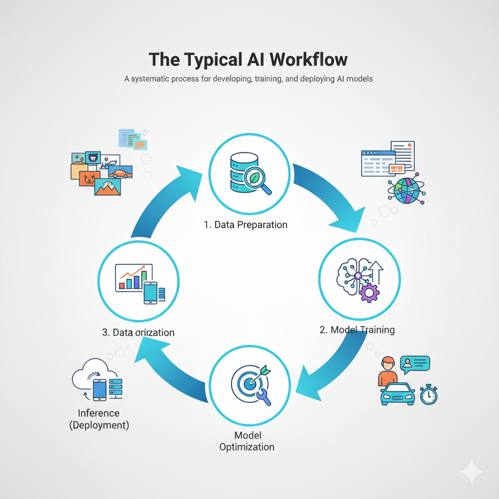
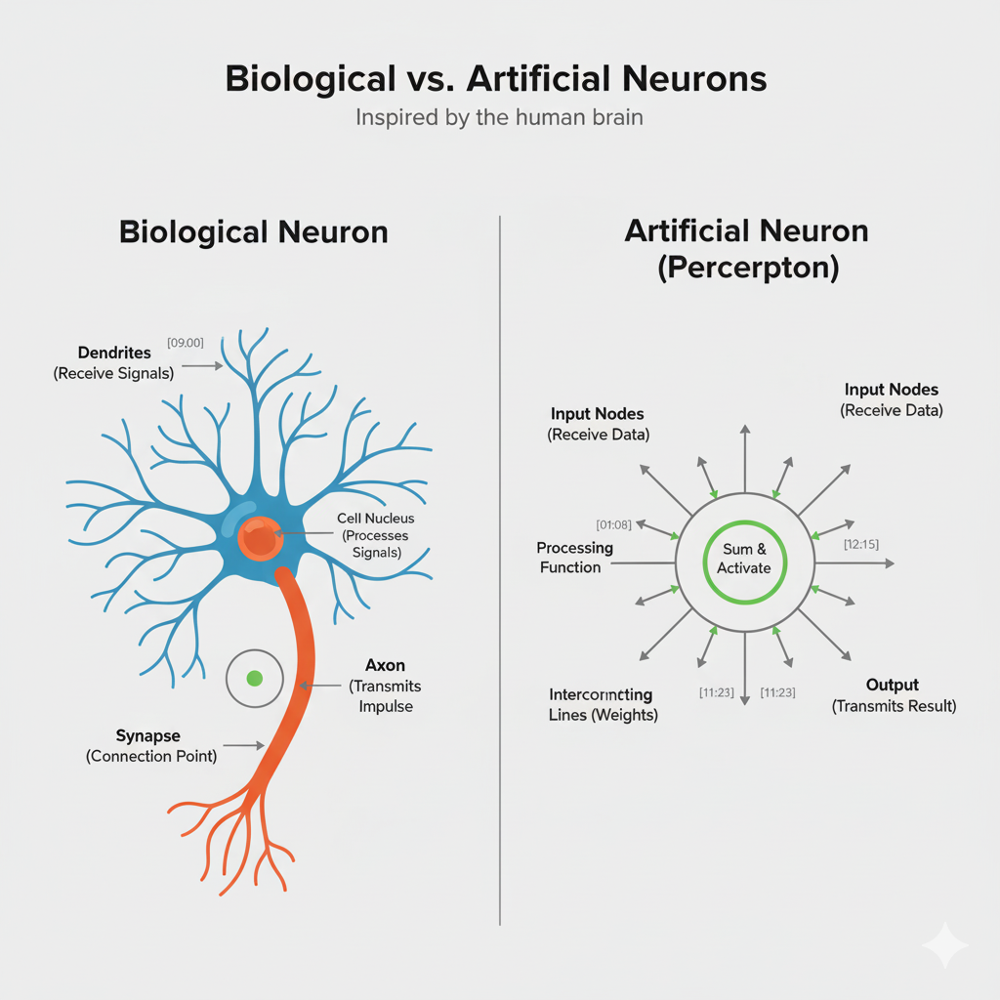
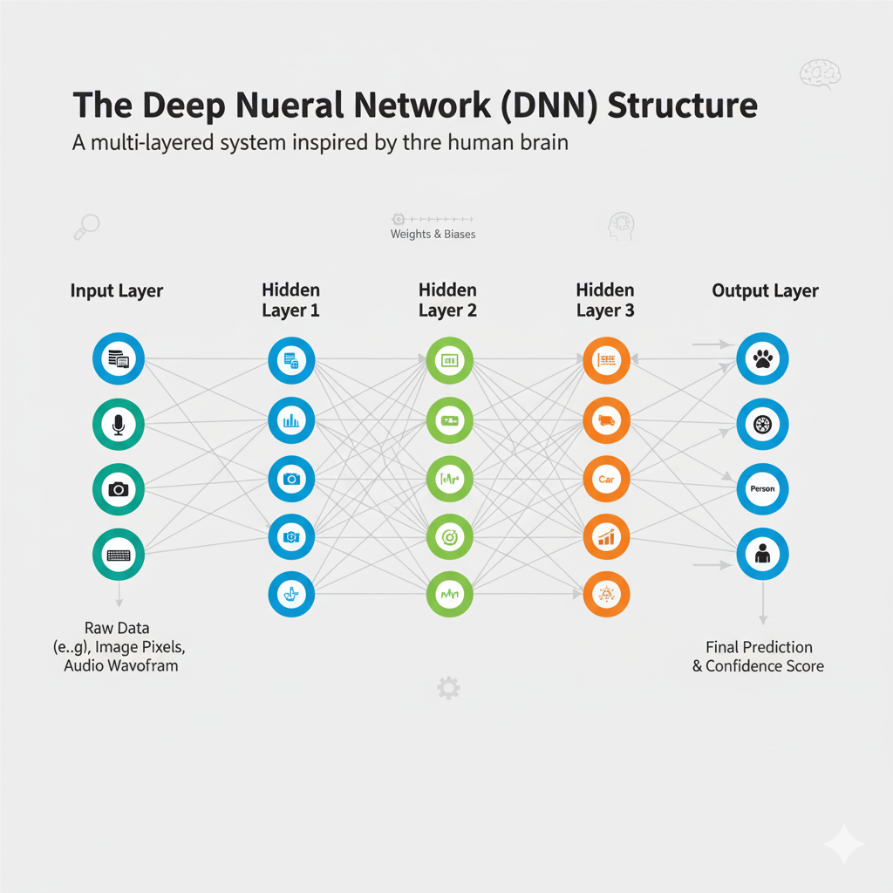

# 💡 Detailed Learning Notes: Introduction to Artificial Intelligence

These notes are based on the video "INTRODUCTION TO ARTIFICIAL INTELLIGENCE | LESSON - 3" and cover the evolution, workflow, deep learning concepts, and deployment challenges of AI.

---

## 🧠 1. Evolution of AI: The Family Tree

| Concept | Description | Key Milestones & Example |
| :--- | :--- | :--- |
| **Artificial Intelligence (AI)** | The broadest field, focused on creating machines that mimic **human intelligence** (problem-solving, learning, decision-making). | Started in the **1950s** (e.g., programs for simple games like Tic-Tac-Toe) [[01:18](http://www.youtube.com/watch?v=oVzI-wt691Y&t=78)]. |
| **Machine Learning (ML)** | A subset of AI where systems learn from **data** *without explicit programming*. It uses statistical methods and relies on **human-engineered features**. | Emerged in the **1980s**. **Example:** An email spam filter trained on keywords and statistical frequency [[01:37](http://www.youtube.com/watch?v=oVzI-wt691Y&t=97)]. |
| **Deep Learning (DL)** | A specialized subset of ML that uses **Deep Neural Networks (DNNs)** with multiple layers to learn complex patterns directly from **raw data**. It **automates feature extraction**. | Breakthroughs around **2010**. **Example:** A system recognizing faces or objects in images directly from the raw pixel data [[02:20](http://www.youtube.com/watch?v=oVzI-wt691Y&t=140)]. |
| **Generative AI** | The cutting edge of DL, utilizing advanced DNNs (like LLMs) to **create new, original content**—text, images, audio—that mimics human output. | The current era (since the mid-2020s). **Example:** ChatGPT generating coherent articles or Midjourney creating images from text prompts [[02:42](http://www.youtube.com/watch?v=oVzI-wt691Y&t=162)]. |

---

## ⚙️ 2. The Typical AI Workflow (MLOps)

The AI workflow is a systematic, iterative process for developing and deploying models, ensuring projects are effective and well-managed [[03:36](http://www.youtube.com/watch?v=oVzI-wt691Y&t=216)].

| Step | Goal & Description | Example Tools |
| :--- | :--- | :--- |
| **1. Data Preparation** [[03:43](http://www.youtube.com/watch?v=oVzI-wt691Y&t=223)] | **Collect, clean, and pre-process raw data.** The quality, diversity, and labeling of the data are crucial for model success. | **NVIDIA Rapids** (GPU-accelerated Python libraries for data manipulation) [[06:23](http://www.youtube.com/watch?v=oVzI-wt691Y&t=383)]. |
| **2. Model Training** [[04:16](http://www.youtube.com/watch?v=oVzI-wt691Y&t=256)] | Use a deep learning framework to teach the model patterns from the **labeled dataset**. The model iteratively adjusts its internal weights to minimize error. | **PyTorch, TensorFlow** (GPU-accelerated deep learning frameworks) [[06:57](http://www.youtube.com/watch?v=oVzI-wt691Y&t=417)]. |
| **3. Model Optimization** [[04:45](http://www.youtube.com/watch?v=oVzI-wt691Y&t=285)] | **Fine-tune the trained model** to make it more **efficient, smaller, and faster** for deployment, often by reducing complexity (pruning, quantization). | **NVIDIA TensorRT** (deep learning inference optimizer) [[07:12](http://www.youtube.com/watch?v=oVzI-wt691Y&t=432)]. |
| **4. Inference (Deployment)** [[05:10](http://www.youtube.com/watch?v=oVzI-wt691Y&t=310)] | Use the optimized model to make **real-time predictions** or generate output based on **new, unseen data** in a production environment. | **NVIDIA Triton Inference Server** (standardizes model deployment, handles load balancing) [[07:29](http://www.youtube.com/watch?v=oVzI-wt691Y&t=449)]. |

---

## 🧠 3. Deep Learning: Neurons and Training

### A. The Inspiration: Biological vs. Artificial Neuron

Deep Learning is fundamentally inspired by the structure of the human brain.

| Feature | Biological Neuron | Artificial Neuron (Perceptron) |
| :--- | :--- | :--- |
| **Signal Reception** | **Dendrites** receive signals [[09:00](http://www.youtube.com/watch?v=oVzI-wt691Y&t=540)]. | **Input Nodes** receive data (multiplied by 'weights') [[11:08](http://www.youtube.com/watch?v=oVzI-wt691Y&t=668)]. |
| **Processing** | **Cell Nucleus** processes and integrates the signal (fires if threshold is met) [[09:14](http://www.youtube.com/watch?v=oVzI-wt691Y&t=554)]. | **Processing Function** sums weighted inputs, passes result through an **activation function** [[12:15](http://www.youtube.com/watch?v=oVzI-wt691Y&t=735)]. |
| **Transmission** | **Axon** carries the impulse to the **Synapse** (connection point) [[09:17](http://www.youtube.com/watch?v=oVzI-wt691Y&t=557)]. | **Output** transmits the result to the next layer via interconnecting lines (which represent weights) [[11:23](http://www.youtube.com/watch?v=oVzI-wt691Y&t=683)]. |

### B. The Training Process (Example: Cat vs. Dog Classifier)

1.  **Input Layer:** Receives the raw data (e.g., the pixel values of an image).
2.  **Hidden Layers (Deep):** Multiple layers where the network learns hierarchical features (Layer 1 might learn edges, Layer 2 shapes, Layer 3 objects).
3.  **Output Layer:** Provides the final prediction (e.g., a high score for "Dog" and a low score for "Cat").

**Learning Steps:**
* **Forward Pass & Prediction:** An image is fed through the network, resulting in a confidence score (e.g., Cat: 0.2, Dog: 0.8) [[13:23](http://www.youtube.com/watch?v=oVzI-wt691Y&t=803)].
* **Error Calculation:** The prediction is compared to the correct **label** (the "ground truth").
* **Backpropagation:** The error is sent backward through the network. Weights that contributed to the wrong answer are **reduced**, and those that contributed to the correct answer are **strengthened**.
* **Iteration:** This loop is repeated across the entire dataset (an **epoch**) multiple times until the network achieves high accuracy, effectively tuning the weights to recognize the correct patterns [[13:55](http://www.youtube.com/watch?v=oVzI-wt691Y&t=835)].

---

## 🤝 4. Challenges and Solutions in Production AI

Enterprises face significant technical and operational hurdles in deploying AI at scale [[18:37](http://www.youtube.com/watch?v=oVzI-wt691Y&t=1117)].

| Challenge | Description | NVIDIA's Solution |
| :--- | :--- | :--- |
| **Exploding Model Sizes** | State-of-the-art models are vast (billions of parameters), demanding extensive computational resources and specialized hardware (GPUs). | Provides **top-tier development tools and frameworks** designed for massive scale and high performance on GPU infrastructure [[20:03](http://www.youtube.com/watch?v=oVzI-wt691Y&t=1203)]. |
| **Performance & Scalability** | Training and customizing models is complex and time-consuming. Production environments demand real-time inference (millisecond response times) at massive scale. | **End-to-End Software Stack** (Rapids, PyTorch/TF, TensorRT, Triton) which accelerates *every step* of the AI lifecycle, from data prep to deployment [[20:24](http://www.youtube.com/watch?v=oVzI-wt691Y&t=1224)]. |
| **Versatility Requirement** | A single application often requires combining multiple powerful models (e.g., Speech-to-Text, LLM, Text-to-Speech) which must be managed concurrently. | Offers **reliable management and orchestration solutions** for IT professionals, ensuring high availability and secure deployment of complex model pipelines [[20:13](http://www.youtube.com/watch?v=oVzI-wt691Y&t=1213)]. |
| **Deployment Inconsistency** | Moving from a "pilot" environment (a single data scientist's computer) to "production" (data center or cloud) often breaks due to architectural differences. | Ensures solutions are **optimized and certified** to deploy everywhere (public Cloud, data centers, Edge), minimizing risk and accelerating time to production [[20:50](http://www.youtube.com/watch?v=oVzI-wt691Y&t=1250)]. |